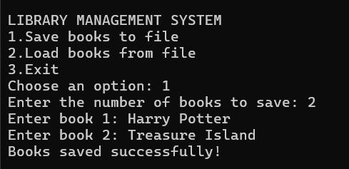

# 📚 Library Management System

## 📌 Project Overview

The Library Management System is a simple C++ project, designed to manage library resources
efficiently. It allows users to store, borrow and manage books. This system is simple but very
effective for small-scalelibrary management and serves as a great introduction to file handling in C++.
This project doesn't rely on databases.

## GitHub Workflow & Team Collaboration

This project allows a **collaborative development approach** using **GitHub**, allowing multiple team members
to work together.
Key aspects include:
- **Branches:** Different features are developed in seperate branches before merging into the main branch.
- **Pull Requests (PRs):** Each change is reviewed through pull requests, ensuring code quality and reducing errors before merging.
- **Version Control:** GitHub allows tracking all changes, making it easy to revert to previous versions if needed.
- **Team Work:** Developers work on different modules, coordinate changes and contribute to a well-structured and maintainable system.

## **Core Features**
- **Stores books in a file.** 
- **User can load books from the file.**
- **User can borrow books.**
- **User can manage books.**
- **User can log in.**
- **Uses C++ language.**

## Usage Example 💻

Below is an example of the Library Management System running in Visual Studio.

## Project Implementation

This project is developed in C++ using structures, arrays, functions, loops, if-else and switch
operators to achieve the desired functionality. The project is suitable mostly for students who have
completed a **Programming Fundamentals** course and want to demonstrate their skills in C++.

## How to Contribute

We appreciate any contributions to improve the **Library Management System** project! Whether you are
fixing a bug, adding a feature, or improving documentation, your help is valuable.
If you are not part of the team:
- **fork** the project to make a copy.
- Submit a **Pull Request** with improvements.
- Reach out to us (the team). 

## 🛠 How to Run Locally

1. Install **Visual Studio** (C++ support).
2. Open a terminal.
3. Clone the repository:

git clone https://github.com/Diona-coder1/LibraryManagementSystem.git

🎓 Acknowledgment & Thank You

We would like to express our sincere gratitude to **Professor Besmir Sejdiu** for their guidance and
invaluable insights. This project has been an excellent oppurtunity for us to apply our **C++ programming skills**
and collaborate as a team using **GitHub**. 

📚 **Library Management System Team**
